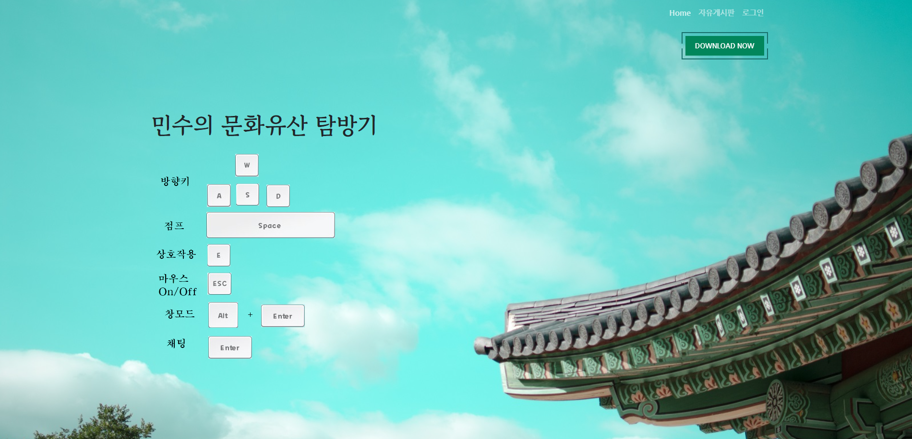
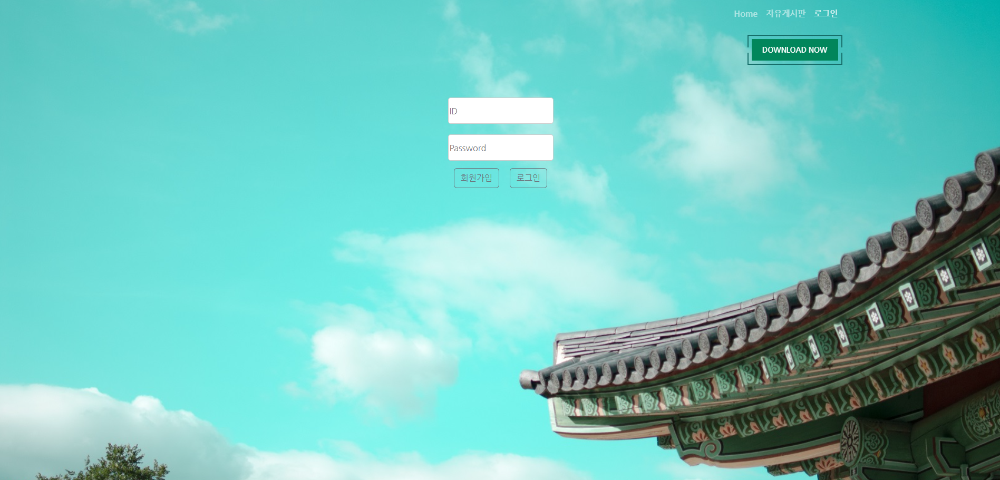
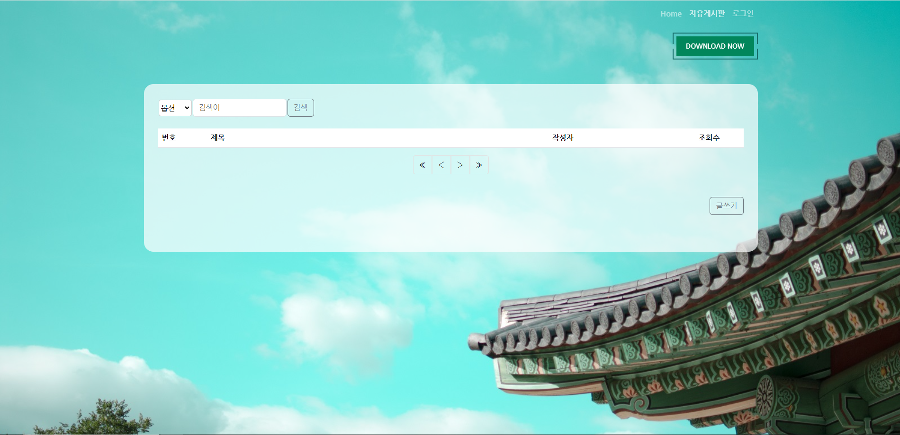
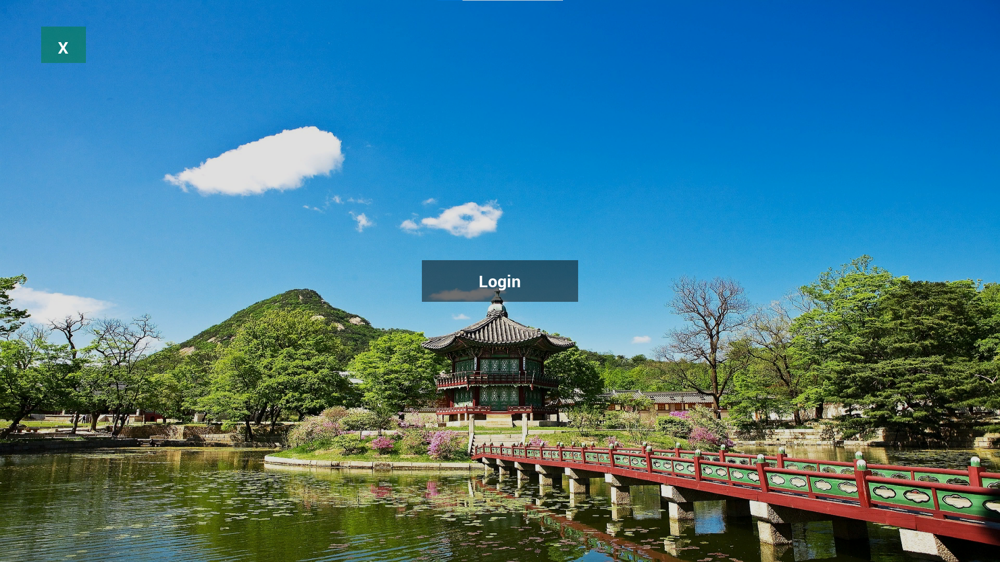
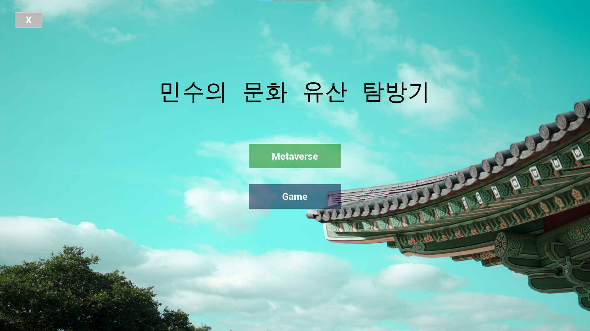
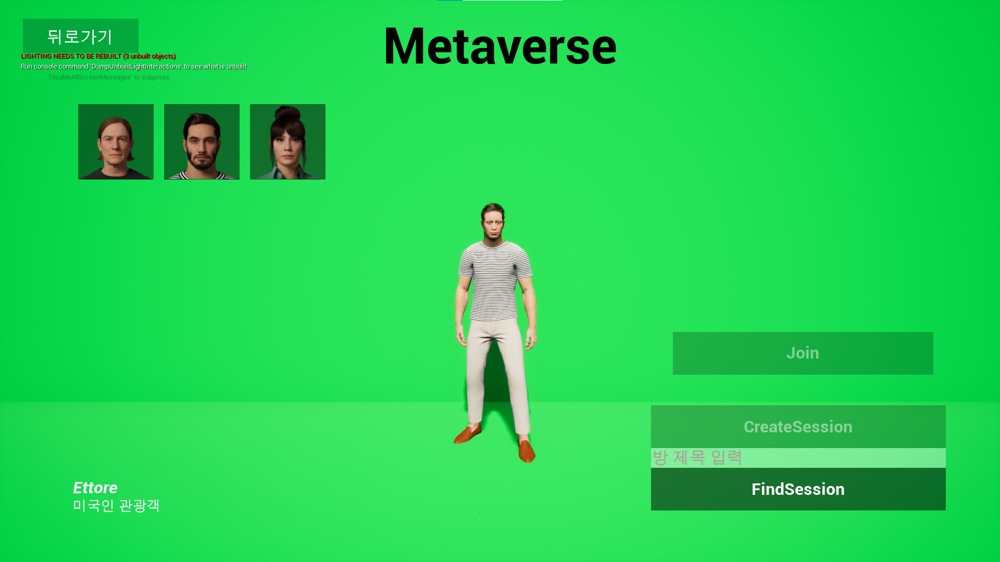
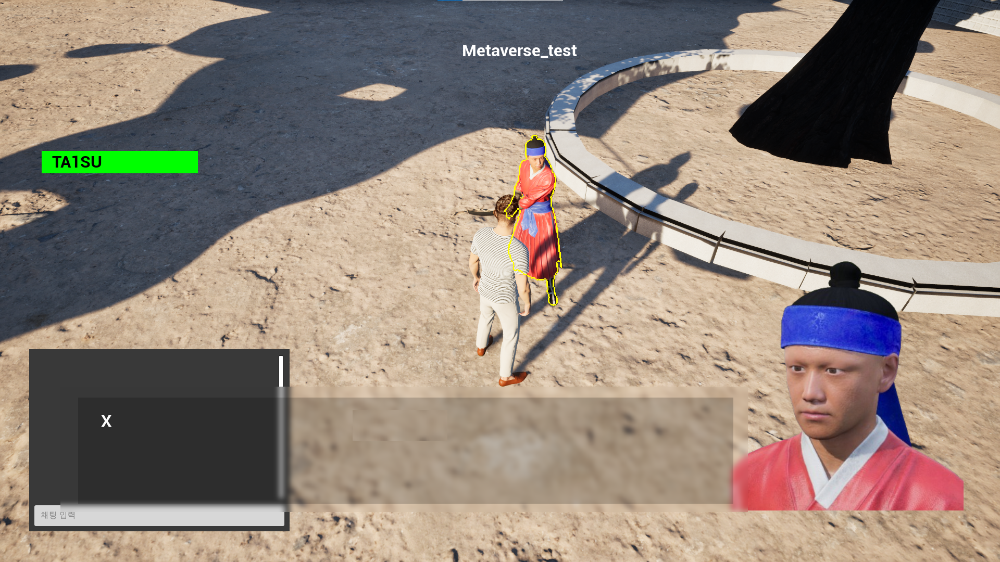
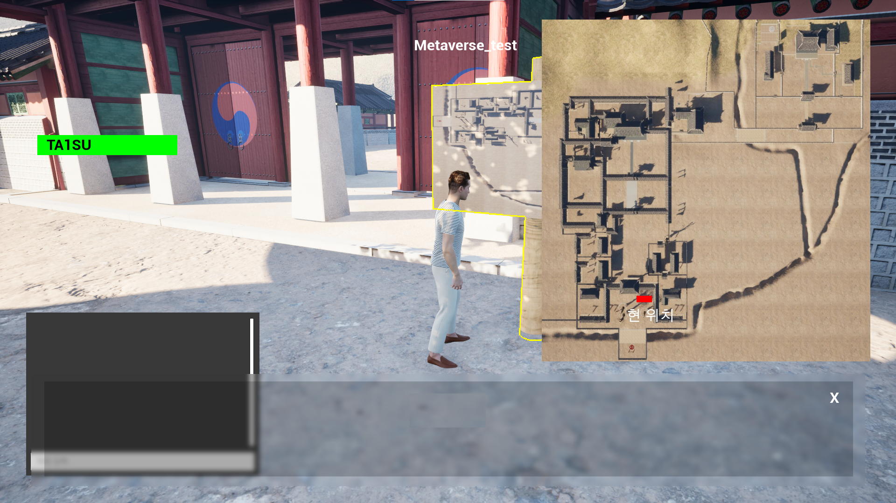
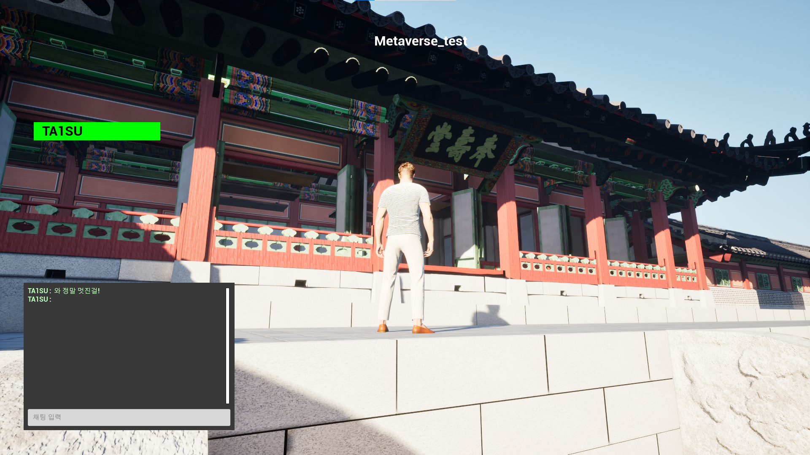
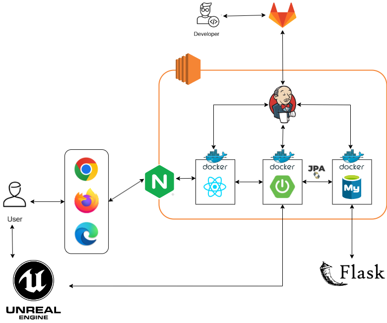

# &nbsp; 민수의 문화 유산 탐방기


## 🗓️프로젝트 진행기간


SSAFY 10기 자율 프로젝트

기간 : 2024.04.08. ~ 2024.05.20.

### 서비스 소개

언리얼 엔진을 통한 메타버스, "민수의 문화 유산 탐방기"

언리얼 엔진의 화려하고 현실적인 그래픽을 통해 만나보세요!

### 🎆주요 기능

- 언리얼 물리 엔진 기반 메타버스로 현실적인 그래픽을 통한 실제와 같은 화면
- 메타버스 내 캐릭터 선택 및 멀티 플레이, 채팅을 이용한 상호작용
- LLM 모델을 활용한 NPC를 통해 다양한 대화 가능


### 서비스 화면
#### 웹사이트
|메인|로그인|자유게시판|
|---|---|---|
|||

#### 메타버스

|메타버스로그인|메타버스메인|메타버스캐릭터선택창|
|---|---|---|
||||


|메타버스화면|메타버스NPC|메타버스표지판|메타버스채팅|
|---|---|---|---|
|||||


### 팀원
|임지현|강준혁|김상민|김수현|임태수|최호연|
|---|---|---|---|---|---|
|팀장|팀원|팀원|팀원|팀원|팀원|

#### 역할

<details>
<summary>임지현</summary>
<div markdown="1">

```
- 팀장
- 최종 발표
- Infra
  - Gitlab Gitflow 환경 구축
  - Jira 일정 관리
  - Jenkins 파이프라인 구축
- AI
  - LLM 모델 생성 매개변수 조정
  - 프롬프트 엔지니어링
  - Flask 서버 구축
  - LangChain RAG 활용한 생성형 AI 성능 향상
  - 맵 정보 및 NPC 데이터 수집 및 전처리
- Backend
  - 다운로드 api 개발
  - NPC DB 설계 및 api 개발
  - 표지판 DB 설계 및 api 개발
- Frontend
  - UI/UX 피그마 디자인
  - 다운로드 기능 구현
```
</div>
</details>

<details>
<summary>강준혁</summary>
<div markdown="1">

```
- Game
  - 언리얼엔진 에셋 디자인
  - 언리얼엔진 게임 테스트
```
</div>
</details>

<details>
<summary>김상민</summary>
<div markdown="1">

```
- Game
  - 언리얼엔진 에셋 디자인
  - 언리얼엔진 게임 테스트
- Backend
  - DB JPA 설계
```
</div>
</details>

<details>
<summary>김수현</summary>
<div markdown="1">

```
- 중간 발표
- 최종 발표 시연
- Game
  - 멀티플레이 구현
  - 맵 최적화
  - 캐릭터 움직임 구현
  - 채팅 구현
  - 미니맵 구현
  - 현재 참여자 목록 구현
  - 캐릭터 선택 구현
  - 에픽 온라인 서비스 로그인 구현
  - NPC, 표지판 api 연동
```
</div>
</details>

<details>
<summary>임태수</summary>
<div markdown="1">

```
- Infra
  - EC2 서버 구축
  - Dockerfile, docker-compose.yml 작성
  - NginX 설정
  - HTTPS 배포
- Game
  - 맵 디자인 및 구현
  - 맵 최적화
- Backend
  - 유저 서비스 구현
  - 게시판 서비스 구현
  - jwt토큰 기반 회원가입, 로그인 구현
- Frontend
  - UI/UX 피그마 디자인
  - 페이지 구조 설계
  - 유저 서비스 페이지 구현
  - 게시판 서비스 페이지 구현
  - 웹사이트 CSS 디자인
```
</div>
</details>

<details>
<summary>최호연</summary>
<div markdown="1">

```
- Game
  - 언리얼엔진 에셋 디자인
  - 언리얼엔진 게임 테스트
```
</div>
</details>


## 🛠기술스택


### BackEnd

&nbsp;
&nbsp;
&nbsp;
&nbsp;

- Java JDK 17
- SpringBoot 3.2.5
- JPA 3.2.5
- Gradle 8.7
- MySQL 8.0.36

### FrontEnd

&nbsp;
&nbsp;
&nbsp;

- React 18.0
- Node.js 20.11.0
- javascript ES6

### AI

&nbsp;
&nbsp;


- Python 3.9.13
- Flask 3.0.3


### CI/CD

&nbsp;
&nbsp;
&nbsp;
&nbsp;
&nbsp;

- AWS EC2
- Ubuntu 20.0.4 LTS
- nginx 1.18.0
- Docker
- Jenkins

### 협업 툴

&nbsp;
&nbsp;
&nbsp;
&nbsp;
&nbsp;


- Git
- Jira
- Mattermost
- Notion
- Figma


## 프로젝트 파일 구조


<details>
<summary>backend</summary>
<div markdown="1">

```
📦backend
 ┣ 📂gradle
 ┃ ┗ 📂wrapper
 ┃ ┃ ┣ 📜gradle-wrapper.jar
 ┃ ┃ ┗ 📜gradle-wrapper.properties
 ┣ 📂src
 ┃ ┣ 📂main
 ┃ ┃ ┣ 📂java
 ┃ ┃ ┃ ┗ 📂com
 ┃ ┃ ┃ ┃ ┗ 📂k10b307
 ┃ ┃ ┃ ┃ ┃ ┗ 📂minsu
 ┃ ┃ ┃ ┃ ┃ ┃ ┣ 📂common
 ┃ ┃ ┃ ┃ ┃ ┃ ┃ ┣ 📂exception
 ┃ ┃ ┃ ┃ ┃ ┃ ┃ ┃ ┣ 📜ResourceNotFoundException.java
 ┃ ┃ ┃ ┃ ┃ ┃ ┃ ┃ ┗ 📜UserException.java
 ┃ ┃ ┃ ┃ ┃ ┃ ┃ ┣ 📜BaseTimeEntity.java
 ┃ ┃ ┃ ┃ ┃ ┃ ┃ ┣ 📜GlobalExceptionHandler.java
 ┃ ┃ ┃ ┃ ┃ ┃ ┃ ┗ 📜Role.java
 ┃ ┃ ┃ ┃ ┃ ┃ ┣ 📂controller
 ┃ ┃ ┃ ┃ ┃ ┃ ┃ ┣ 📜CommentController.java
 ┃ ┃ ┃ ┃ ┃ ┃ ┃ ┣ 📜DescController.java
 ┃ ┃ ┃ ┃ ┃ ┃ ┃ ┣ 📜DownloadController.java
 ┃ ┃ ┃ ┃ ┃ ┃ ┃ ┣ 📜FileController.java
 ┃ ┃ ┃ ┃ ┃ ┃ ┃ ┣ 📜NpcController.java
 ┃ ┃ ┃ ┃ ┃ ┃ ┃ ┣ 📜PostController.java
 ┃ ┃ ┃ ┃ ┃ ┃ ┃ ┗ 📜UserController.java
 ┃ ┃ ┃ ┃ ┃ ┃ ┣ 📂domai
 ┃ ┃ ┃ ┃ ┃ ┃ ┣ 📂dto
 ┃ ┃ ┃ ┃ ┃ ┃ ┃ ┣ 📂request
 ┃ ┃ ┃ ┃ ┃ ┃ ┃ ┃ ┣ 📂comment
 ┃ ┃ ┃ ┃ ┃ ┃ ┃ ┃ ┃ ┗ 📜CommentDto.java
 ┃ ┃ ┃ ┃ ┃ ┃ ┃ ┃ ┣ 📂post
 ┃ ┃ ┃ ┃ ┃ ┃ ┃ ┃ ┃ ┣ 📜PostUpdateDto.java
 ┃ ┃ ┃ ┃ ┃ ┃ ┃ ┃ ┃ ┣ 📜PostWriteDto.java
 ┃ ┃ ┃ ┃ ┃ ┃ ┃ ┃ ┃ ┗ 📜SearchData.java
 ┃ ┃ ┃ ┃ ┃ ┃ ┃ ┃ ┗ 📂user
 ┃ ┃ ┃ ┃ ┃ ┃ ┃ ┃ ┃ ┣ 📜UserLoginDto.java
 ┃ ┃ ┃ ┃ ┃ ┃ ┃ ┃ ┃ ┣ 📜UserRegisterDto.java
 ┃ ┃ ┃ ┃ ┃ ┃ ┃ ┃ ┃ ┗ 📜UserUpdateDto.java
 ┃ ┃ ┃ ┃ ┃ ┃ ┃ ┗ 📂response
 ┃ ┃ ┃ ┃ ┃ ┃ ┃ ┃ ┣ 📂comment
 ┃ ┃ ┃ ┃ ┃ ┃ ┃ ┃ ┃ ┗ 📜ResCommentDto.java
 ┃ ┃ ┃ ┃ ┃ ┃ ┃ ┃ ┣ 📂file
 ┃ ┃ ┃ ┃ ┃ ┃ ┃ ┃ ┃ ┣ 📜ResFileDownloadDto.java
 ┃ ┃ ┃ ┃ ┃ ┃ ┃ ┃ ┃ ┣ 📜ResFileUploadDto.java
 ┃ ┃ ┃ ┃ ┃ ┃ ┃ ┃ ┃ ┗ 📜ResPostDetailsFileDto.java
 ┃ ┃ ┃ ┃ ┃ ┃ ┃ ┃ ┣ 📂post
 ┃ ┃ ┃ ┃ ┃ ┃ ┃ ┃ ┃ ┣ 📜ResPostDetailsDto.java
 ┃ ┃ ┃ ┃ ┃ ┃ ┃ ┃ ┃ ┣ 📜ResPostListDto.java
 ┃ ┃ ┃ ┃ ┃ ┃ ┃ ┃ ┃ ┗ 📜ResPostWriteDto.java
 ┃ ┃ ┃ ┃ ┃ ┃ ┃ ┃ ┗ 📂user
 ┃ ┃ ┃ ┃ ┃ ┃ ┃ ┃ ┃ ┣ 📜UserResponseDto.java
 ┃ ┃ ┃ ┃ ┃ ┃ ┃ ┃ ┃ ┗ 📜UserTokenDto.java
 ┃ ┃ ┃ ┃ ┃ ┃ ┣ 📂entity
 ┃ ┃ ┃ ┃ ┃ ┃ ┃ ┣ 📜Comment.java
 ┃ ┃ ┃ ┃ ┃ ┃ ┃ ┣ 📜Description.java
 ┃ ┃ ┃ ┃ ┃ ┃ ┃ ┣ 📜FileEntity.java
 ┃ ┃ ┃ ┃ ┃ ┃ ┃ ┣ 📜Npc.java
 ┃ ┃ ┃ ┃ ┃ ┃ ┃ ┣ 📜Post.java
 ┃ ┃ ┃ ┃ ┃ ┃ ┃ ┗ 📜User.java
 ┃ ┃ ┃ ┃ ┃ ┃ ┣ 📂repository
 ┃ ┃ ┃ ┃ ┃ ┃ ┃ ┣ 📜CommentRepository.java
 ┃ ┃ ┃ ┃ ┃ ┃ ┃ ┣ 📜DescRepository.java
 ┃ ┃ ┃ ┃ ┃ ┃ ┃ ┣ 📜FileRepository.java
 ┃ ┃ ┃ ┃ ┃ ┃ ┃ ┣ 📜NpcRepository.java
 ┃ ┃ ┃ ┃ ┃ ┃ ┃ ┣ 📜PostRepository.java
 ┃ ┃ ┃ ┃ ┃ ┃ ┃ ┗ 📜UserRepository.java
 ┃ ┃ ┃ ┃ ┃ ┃ ┣ 📂security
 ┃ ┃ ┃ ┃ ┃ ┃ ┃ ┣ 📂jwt
 ┃ ┃ ┃ ┃ ┃ ┃ ┃ ┃ ┣ 📜CustomUserDetailsService.java
 ┃ ┃ ┃ ┃ ┃ ┃ ┃ ┃ ┣ 📜JwtAuthenticationEntryPoint.java
 ┃ ┃ ┃ ┃ ┃ ┃ ┃ ┃ ┣ 📜JwtAuthenticationFilter.java
 ┃ ┃ ┃ ┃ ┃ ┃ ┃ ┃ ┗ 📜JwtTokenUtil.java
 ┃ ┃ ┃ ┃ ┃ ┃ ┃ ┣ 📜CorsConfig.java
 ┃ ┃ ┃ ┃ ┃ ┃ ┃ ┣ 📜PwdEncoderConfig.java
 ┃ ┃ ┃ ┃ ┃ ┃ ┃ ┗ 📜SecurityConfig.java
 ┃ ┃ ┃ ┃ ┃ ┃ ┣ 📂service
 ┃ ┃ ┃ ┃ ┃ ┃ ┃ ┣ 📜CommentService.java
 ┃ ┃ ┃ ┃ ┃ ┃ ┃ ┣ 📜DescService.java
 ┃ ┃ ┃ ┃ ┃ ┃ ┃ ┣ 📜FileService.java
 ┃ ┃ ┃ ┃ ┃ ┃ ┃ ┣ 📜NpcService.java
 ┃ ┃ ┃ ┃ ┃ ┃ ┃ ┣ 📜PostService.java
 ┃ ┃ ┃ ┃ ┃ ┃ ┃ ┗ 📜UserService.java
 ┃ ┃ ┃ ┃ ┃ ┃ ┗ 📜MinsuApplication.java
 ┃ ┃ ┗ 📂resources
 ┃ ┃ ┃ ┣ 📂static
 ┃ ┃ ┃ ┃ ┗ 📜index.html
 ┃ ┃ ┃ ┣ 📜application-jwt.properties
 ┃ ┃ ┃ ┣ 📜application-oauth.properties
 ┃ ┃ ┃ ┗ 📜application.properties
 ┃ ┗ 📂test
 ┃ ┃ ┗ 📂java
 ┃ ┃ ┃ ┗ 📂com
 ┃ ┃ ┃ ┃ ┗ 📂k10b307
 ┃ ┃ ┃ ┃ ┃ ┗ 📂minsu
 ┃ ┃ ┃ ┃ ┃ ┃ ┗ 📜MinsuApplicationTests.java
 ┣ 📜.gitignore
 ┣ 📜build.gradle
 ┣ 📜Dockerfile
 ┣ 📜gradlew
 ┣ 📜gradlew.bat
 ┗ 📜settings.gradle
```

</div>
</details>


<details>
<summary>frontend</summary>
<div markdown="1">

```
📦frontend
 ┗ 📂minsu
 ┃ ┣ 📂public
 ┃ ┃ ┗ 📜vite.svg
 ┃ ┣ 📂src
 ┃ ┃ ┣ 📂assets
 ┃ ┃ ┃ ┣ 📜key.png
 ┃ ┃ ┃ ┣ 📜main.jpg
 ┃ ┃ ┃ ┗ 📜react.svg
 ┃ ┃ ┣ 📂components
 ┃ ┃ ┃ ┣ 📂app
 ┃ ┃ ┃ ┃ ┣ 📜Header.jsx
 ┃ ┃ ┃ ┃ ┣ 📜Home.jsx
 ┃ ┃ ┃ ┃ ┗ 📜Main.jsx
 ┃ ┃ ┃ ┣ 📂comment
 ┃ ┃ ┃ ┃ ┣ 📜Comment.jsx
 ┃ ┃ ┃ ┃ ┣ 📜CommentList.jsx
 ┃ ┃ ┃ ┃ ┗ 📜CommentWrite.jsx
 ┃ ┃ ┃ ┣ 📂context
 ┃ ┃ ┃ ┃ ┣ 📜AuthProvider.jsx
 ┃ ┃ ┃ ┃ ┗ 📜HttpHeadersProvider.jsx
 ┃ ┃ ┃ ┣ 📂download
 ┃ ┃ ┃ ┃ ┣ 📜Download.css
 ┃ ┃ ┃ ┃ ┗ 📜Download.jsx
 ┃ ┃ ┃ ┣ 📂file
 ┃ ┃ ┃ ┃ ┣ 📜FileDisplay.jsx
 ┃ ┃ ┃ ┃ ┗ 📜FileManager.jsx
 ┃ ┃ ┃ ┣ 📂post
 ┃ ┃ ┃ ┃ ┣ 📜PostAnswer.jsx
 ┃ ┃ ┃ ┃ ┣ 📜PostDetail.jsx
 ┃ ┃ ┃ ┃ ┣ 📜PostList.jsx
 ┃ ┃ ┃ ┃ ┣ 📜PostUpdate.jsx
 ┃ ┃ ┃ ┃ ┗ 📜PostWrite.jsx
 ┃ ┃ ┃ ┣ 📂router
 ┃ ┃ ┃ ┃ ┗ 📜Router.jsx
 ┃ ┃ ┃ ┣ 📂user
 ┃ ┃ ┃ ┃ ┣ 📜CheckPwd.jsx
 ┃ ┃ ┃ ┃ ┣ 📜Login.jsx
 ┃ ┃ ┃ ┃ ┣ 📜Logout.jsx
 ┃ ┃ ┃ ┃ ┣ 📜Register.jsx
 ┃ ┃ ┃ ┃ ┗ 📜UserUpdate.jsx
 ┃ ┃ ┃ ┗ 📜connect.jsx
 ┃ ┃ ┣ 📂css
 ┃ ┃ ┃ ┣ 📜commentList.css
 ┃ ┃ ┃ ┣ 📜fileDisplay.css
 ┃ ┃ ┃ ┣ 📜footer.css
 ┃ ┃ ┃ ┣ 📜home.css
 ┃ ┃ ┃ ┣ 📜login.css
 ┃ ┃ ┃ ┣ 📜main.css
 ┃ ┃ ┃ ┣ 📜page.css
 ┃ ┃ ┃ ┣ 📜postdetail.css
 ┃ ┃ ┃ ┣ 📜postlist.css
 ┃ ┃ ┃ ┣ 📜postupdate.css
 ┃ ┃ ┃ ┣ 📜postwrite.css
 ┃ ┃ ┃ ┣ 📜register.css
 ┃ ┃ ┃ ┗ 📜style.css
 ┃ ┃ ┣ 📜App.css
 ┃ ┃ ┣ 📜App.jsx
 ┃ ┃ ┣ 📜index.css
 ┃ ┃ ┗ 📜index.jsx
 ┃ ┣ 📜.env
 ┃ ┣ 📜.eslintrc.cjs
 ┃ ┣ 📜.gitignore
 ┃ ┣ 📜Dockerfile
 ┃ ┣ 📜index.html
 ┃ ┣ 📜kor.png
 ┃ ┣ 📜nginx.conf
 ┃ ┣ 📜package-lock.json
 ┃ ┣ 📜package.json
 ┃ ┣ 📜README.md
 ┃ ┗ 📜vite.config.js
```

</div>
</details>


## 프로젝트 아키텍처
